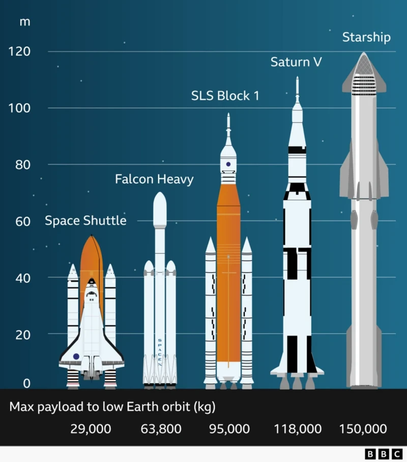

# SpaceX Starship: 14th Flight

Elon Musk's company SpaceX is preparing to launch its Starship spacecraft into Earth's orbit for the first time.

It marks the spacecraft's 14th flight. Previous tests were suborbital - a flight where the spacecraft reaches space, but does not travel fast enough or long enough to stay there.

The rocket splits in two shortly after take off - the booster, which is the bottom half, will fall back to Earth roughly seven minutes after launch, landing in the Gulf of Mexico.

During the 10-hour flight, Starship will aim to complete roughly six orbits of Earth and deploy Starlink V3 satellites, before splashing down in the Pacific Ocean, west of Chile.

Musk hopes to revolutionise space travel by eventually making Starship the world's first fully-reusable launch vehicle.

He also hopes the spacecraft will one day carry crew to the Moon, Mars and beyond. Today, it is uncrewed.

Previous test flights haven't all been smooth sailing with several incidents in 2025, including the rocket exploding into a giant fireball on its stand in June. Recent tests have been more successful.

---

## What is a Spaceship?

Starship is a spacecraft and rocket designed by Elon Musk's company SpaceX.

Musk wants it to revolutionise spaceflight by being "fully reusable" - something he has previously characterised as the "holy grail" of space technology.

The company describes Starship as "the world's most powerful launch vehicle ever developed", designed to eventually carry crew and cargo "to Earth orbit, the Moon, Mars and beyond".

It consists of two main parts - the spacecraft and the so-called Super Heavy rocket. Starship is 124m (407ft) in height and 9m wide.

Its payload capacity (the maximum mass a launch vehicle can deliver to a particular orbit) is more than 100 tonnes.

Its longer-term aim is to be able to carry up to 100 people on "long-duration, interplanetary flights". This flight - its 14th test flight - is uncrewed and aims to send Starship into orbit around Earth for the first time.

Both parts of the rocket will land in the sea today but usually the booster is caught during a controlled landing - this is part of the mission to make the Starship fully reusable in the future.

If all goes to plan, Starship 14 will go orbital today for the first time, looping around Earth as many as six times.

It’s a significant test of SpaceX as the company tries to move Starship out of its testing phase into full, reliable operation.

SpaceX has proven it can build the world’s largest and most powerful rocket to date - the rocket today will stand at more than 100 metres.

But it needs to show that it can get the capsule beyond Earth’s sub-orbit. Since launching for the first time three years ago, nearly half of Starship’s 13 missions have ended in unintended explosions.

SpaceX says its motto is to push capacities to the extreme and that it is content to fail along the way - but the clock is ticking for the company to prove to US space agency Nasa that it has reliable space vehicles and systems.

Starship has a multi-billion dollar contract with Nasa to carry astronauts to the Moon as part of America’s Artemis programme.

Today could mark a new phase in the development of SpaceX’s rocket, but also introduce new risks as it will be harder to quickly pull the capsule back to Earth if something goes wrong.

---

## The launch

The Starship rocket launched as it headed towards Earth's orbit for the first time.

The upper-stage rocket separated from the Super Heavy booster. The booster then splashed down in the Gulf of Mexico about five minutes later, with large applause from SpaceX.

SpaceX does have the ability to catch it at a landing pad, but opted not to for today's test.

One of the booster’s 33 engines may have shut down, but that didn't stop Starship from launching.

The flight started with the speed passing 10,000km/h, and soon after the speed was already over 26,000km/h.

The engine was then cut off on the Ship, the top part of the rocket that remained in flight.

One of the six engines shut down earlier than planned, creating an engine issue during ascent. The vehicle nevertheless reached space successfully.

The team initially decided not to perform the additional burn required for orbital insertion, but later reassessed the situation and continued with the orbital attempt.

---

## The decision to go into orbit

Some drama followed as SpaceX decided whether or not to push Starship 14 into orbit. After reported issues with one of the craft's six RVacs or engines, the company's engineers needed to make the final call.

It was a big decision because once the Starship went into Earth's orbit, it was much harder to pull the craft back down to Earth in case of a problem, so the flight became more dangerous.

SpaceX wanted to be sure that it was the right decision to push Starship into orbit, rather than re-schedule the flight.

The company ultimately confirmed that Starship would launch into orbit as planned.

We are now seeing the spaceship enter orbit as the orbital insertion burn begins. It was the first time the rocket had entered Earth's orbit.

Starship then deployed 26 Starlink satellites.

---

## Starlink satellites

SpaceX then undertook the next phase of the mission. Starship started to deploy its payload - 26 Starlink V3 satellites.

All 26 satellites were deployed from Starship.

Until then, all Starship flights had been suborbital, meaning the capsules were high enough to reach space, but did not travel fast enough or long enough to complete a loop around the Earth. Most of the previous flights were about one hour.

Starship travelled at about 275km above Earth in orbit, and the company pushed the craft to its limits. That involved collecting data throughout the flight and deploying new generation Starlink satellites.

The rocket passed over Madagascar, after passing over the southern tip of South Africa, having been launched from Texas in the US.

---

## Mission checkpoint

As reported earlier, one of the six RVac engines had shut down unexpectedly, prompting a review of whether Starship should continue with its planned orbital insertion burn.

According to SpaceX's livestream, the RVac engines were not needed for the rest of the journey, but engineers reviewed the health of the remaining engines, particularly the three sea-level engines.

The team examined the indicators for those engines and decided they looked healthy.

As a result, they voted for the operation to go ahead as planned.

SpaceX then reached its initial checkpoint. The team checked everything and decided whether Starship needed to return early.

The mission had originally planned to have the rocket orbit the Earth six times, but Starship returned early instead.

---

## Starship returns early

Starship returned to Earth earlier than the planned 10-hour flight in space.

The spacecraft took its first checkpoint and came back early, meaning it did not spend as many orbits around Earth.

Despite returning the craft early, the mission was considered a "wildly successful day so far".

All 26 Starlink V3 satellites had been deployed.

The deorbit burn happened around two hours and 12 minutes into the flight.

Starship then headed towards the Pacific Ocean, where it landed a little over three hours into the mission.

---

## Starlink satellites delivered into orbit will 'greatly' increase user speeds – SpaceX

One of the objectives of the mission, which had already been completed, was the delivery of 26 "next generation" Starlink V3 satellites into orbit.

Those joined the existing Starlink constellation in low Earth orbit which deliver broadband internet on Earth.

The new satellites added during the mission will "greatly expand the network's capacity and user speeds", SpaceX says.

As reported earlier, the satellites were carried into orbit by the Starship. After exiting the Starship they unfold their antennas and make initial contact with the ground and the rest of the satellite constellation via radio and laser links, SpaceX says.

---

## Nasa congratulates SpaceX

Nasa administrator Jared Isaacman congratulated SpaceX on its Starship mission.

Writing on X he said it was a, external "gorgeous launch, getting Ship to orbit and managing every step in a safe, responsible, and especially inspirational way".

He added that Nasa is "excited to help where we can and for Starship missions to become routine!"

In 2024, Isaacman became the first non-professional astronaut to walk in space.

---

## The return to Earth

Starship began its de-orbit burn about two hours and 12 minutes into the flight.

The burn lasted about 11 seconds, marking the start of its return to Earth.

SpaceX had originally planned for Starship to de-orbit about nine hours into the mission, but the mission ended early after the ship reached its first checkpoint about 90 minutes into the flight.

The de-orbit burn successfully sent Starship towards Earth.

A "light show" then began as Starship moved through the upper parts of Earth's atmosphere.

The plasma built up as Starship made its way through the atmosphere.

The formal entry point came about two hours and 47 minutes into the flight.

SpaceX targeted a landing at around three hours, eight minutes and 30 seconds into the flight.

If the Starship's engines hadn't engaged in the de-orbit burn and it hadn't happened effectively, the consequences would have been that the Starship could have stayed orbiting Earth, science journalist Caroline Steel tells the BBC.

This would add to the space junk problem that we have, she says.

SpaceX "really only wanted to keep orbiting if they were sure they would be able to get the Starship back down to earth", she adds.

"That was incredibly impressive seeing how small and short that engine blast was to get the rocket back down to Earth. Tiny changes in angles and speeds really add up over time."

Steel explains now the rocket is going in a slightly different direction, and the gravitational pull will bring it back down to Earth.

Starship then re-entered Earth’s atmosphere.

---

## Splashdown

Starship was about three hours into its flight and only a few minutes away from splashing down.

The light show showed it entering the Earth's atmosphere. It lined up for a splashdown in the Northern Pacific, SpaceX says.

The livestream showed the "plasma build up" as it was "rapidly" slowing down, SpaceX says.

Starship then splashed down in the Pacific Ocean.

That came after the spacecraft completed about three hours of orbital flight.

The mission was supposed to last about 10 hours, but SpaceX announced it was ending early after 90 minutes.

That was not the soft splashdown that the 13th test flight saw back in July. Back then, there was no big fireball like the one we just witnessed.

Nonetheless, huge cheers were heard from the crowd behind the SpaceX livestream when the rocket landed in the Pacific Ocean with a huge fireball.

---

## The result

Now, both parts of the rocket are in the northern hemisphere.

SpaceX will be absolutely delighted with how today went.

This was the first time they were aiming to send Starship into Earth's orbit – before now they had only made it to sub-orbit. They have now reached the velocity and height needed to propel it into orbit after deciding to push on after some drama over one engine not working properly.

It was however supposed to be a nine-hour flight with three loops of the earth, but they've cut that down to two loops now.

We don't know why, but some observers have said the capsule was looking a bit ropey, and perhaps there were signs that SpaceX wanted to bring it back early just to be cautious.

Ultimately, SpaceX wants its rockets and spacecrafts to be reusable. SpaceX chief executive Elon Musk frequently boasts that this will be a core feature of Starship and is an important part of the company's business model.

SpaceX has previously pulled off spectacular catches of its rocket boosters in the signature "chop-stick" manoeuvre – when two giant pincers catch the fiery booster as they fall back to Earth. The first time that happened was October 2024.

But in this launch, neither the booster nor spacecraft will be recovered for re-use. The booster landed in the Gulf of Mexico, and the Starship 14 capsule splashed down in the Pacific Ocean.

SpaceX usually try to collect the booster and capsules that return to Earth to analyse what happened to them during flight - that may not be possible with the Ship today after it landed so explosively.

---

## Source

📚 **Source:** [BBC News — Starship's 14th flight](https://www.bbc.com/news/live/c65ymmpzev1mt)