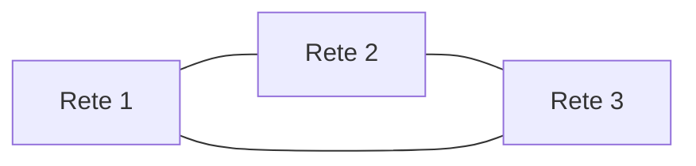
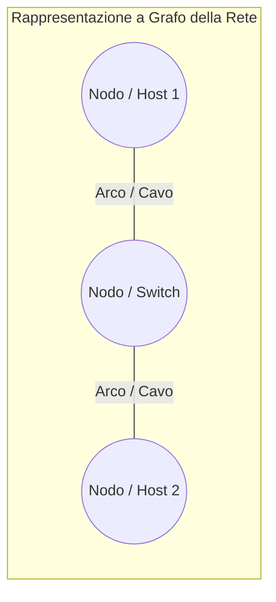
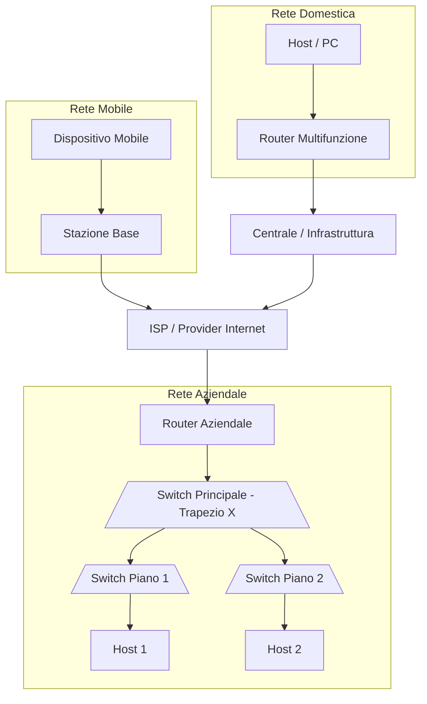
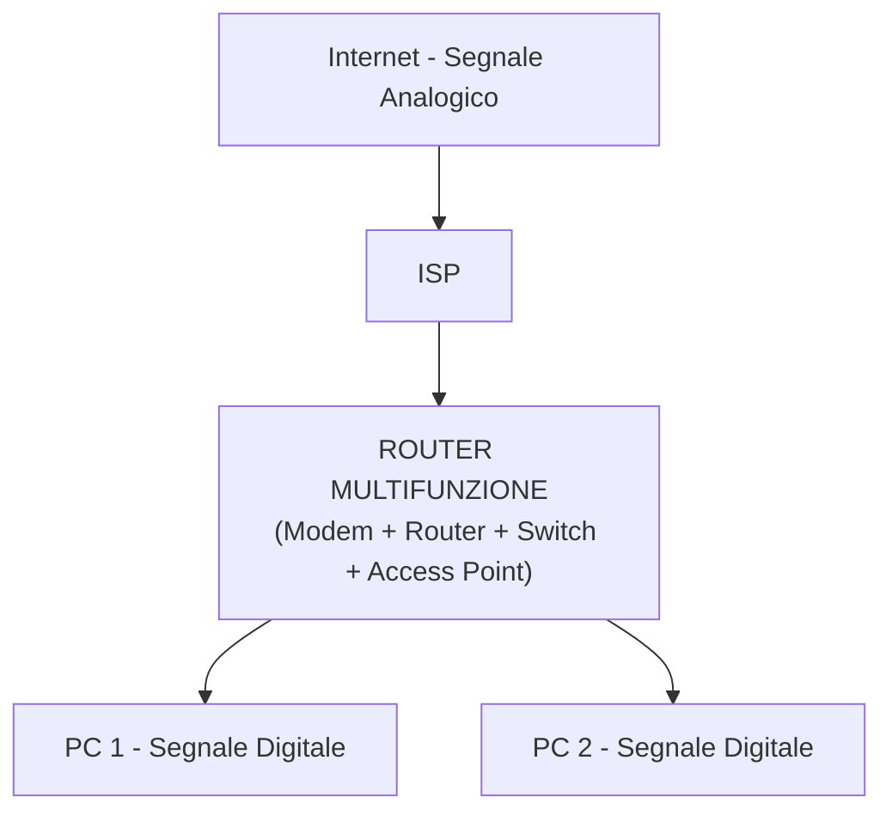
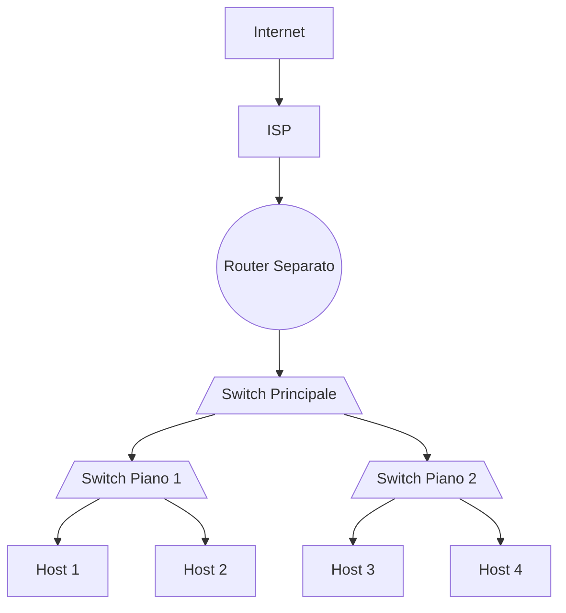
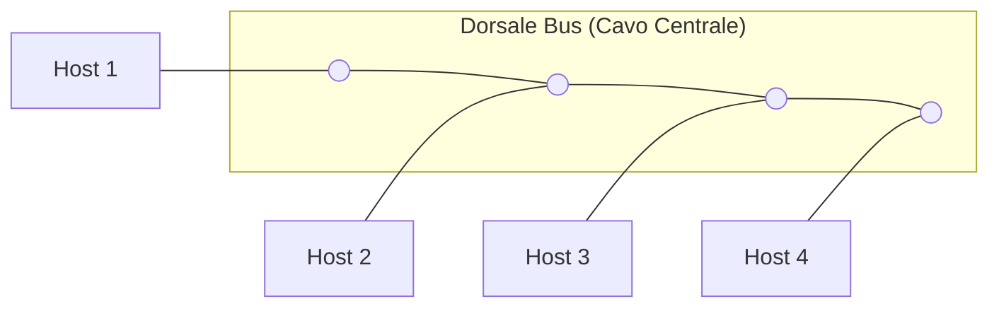
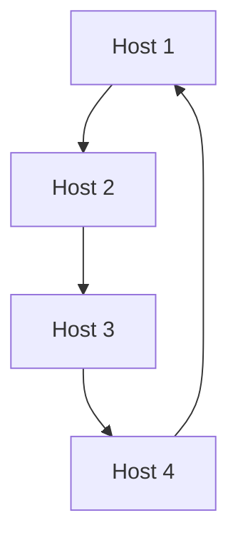
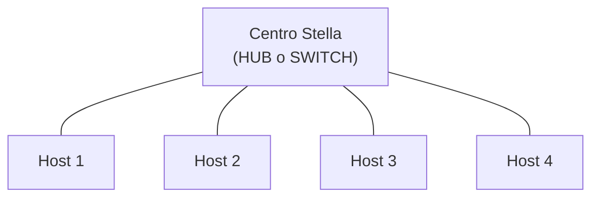

# Appunti di Sistemi e Reti

**Data lezione:** 16/09  
**Argomenti:** Introduzione alle reti, dispositivi di rete, architetture e topologie.

## 1. Introduzione alla Rete

Una **rete** è un insieme di dispositivi interconnessi per la condivisione di:
* **Dati** (sotto forma di *pacchetti*).
* **Risorse** (hardware e software, es. stampanti, server di archiviazione).

### Ambito applicativo e tipologie di reti

* **ARPANET:** La prima rete a commutazione di pacchetto, antenata e precursore della moderna Internet.
* **Intranet:** Rete privata e riservata a una specifica organizzazione.
* **Internet:** Rete globale interconnessa.
* **IoT (Internet of Things):** Oggetti intelligenti connessi in rete.

## 2. Componenti di una Rete

I componenti di una rete possono essere modellati come **GRAFI**, costituiti da:
* **NODI:** Dispositivi fisici (host, router, switch).
* **ARCHI:** Collegamenti fisici o wireless (mezzi trasmissivi) tra i nodi.

### 1. Host / End Devices / Terminali

Dispositivi utente (nodi terminali) che generano o ricevono dati. Ogni host possiede:
* **Indirizzo Logico:** Indirizzo **IP** (utilizzato per l'instradamento nella rete).
* **Indirizzo Fisico:** Indirizzo **MAC** (identificativo univoco dell'interfaccia di rete).

### 2. Intermediary Devices (Dispositivi Intermedi)

Dispositivi che gestiscono e instradano il traffico di rete tra i terminali:
* **Router** ($\otimes$): Connette **reti diverse** (es. la rete locale a Internet).
* **Switch** (rappresentato graficamente come un **trapezio con una X all'interno**): Connette dispositivi appartenenti alla **stessa rete locale**.
* **Firewall**: Filtra il traffico di rete in ingresso e in uscita per garantire la sicurezza.
* **Access Point (AP)**: Crea o espande una rete locale mediante onde radio (**Wi-Fi**).

### 3. Mezzo Trasmissivo

Il supporto fisico o immateriale (archi del grafo) attraverso cui viaggiano i dati (cavi in rame/UTP, fibra ottica, onde radio).

---

## 3. Architetture di Rete

### Schematizzazione del Percorso di Rete

### Dettaglio: Rete Domestica vs Rete Aziendale

#### A. Rete Domestica
In ambito domestico si utilizza un **Router Multifunzione** che integra in un unico dispositivo:
1. **Modem:** Effettua la **modulazione** (digitale $\rightarrow$ analogico) e **demodulazione** (analogico $\rightarrow$ digitale).
2. **Router:** Per l'instradamento dei pacchetti verso Internet.
3. **Switch:** Per la connessione cablata dei dispositivi locali.
4. **Access Point (AP):** Per la connessione Wi-Fi dei dispositivi wireless.

#### B. Rete Aziendale
Architettura gerarchica con dispositivi dedicati e separati per garantire alte prestazioni e scalabilità:

---

## 4. Ruolo degli Host e Tipi di Rete

### Ruolo degli Host
* **Client:** Host che *richiede* un servizio.
* **Server:** Host che *eroga* o fornisce il servizio.

### Classificazione per Estensione Geografica
1. **LAN (Local Area Network):** Rete ad estensione locale (es. abitazione, scuola, ufficio).
2. **WAN (Wide Area Network):** Rete ad ampia estensione geografica (es. tra città o nazioni diverse).
3. **Internet:** La "rete delle reti" globale basata sulla suite di protocolli **TCP/IP**.

### Classificazione Dimensionale
1. **Home Network:** Rete domestica di piccole dimensioni.
2. **SOHO (Small Office / Home Office):** Piccoli uffici. Il router è separato dallo switch ed è più potente rispetto a quello domestico.
3. **Medium / Large Network:** Reti aziendali strutturate a più livelli.
4. **WAN:** Reti geografiche globali.

---

## 5. Topologie di Rete

La topologia descrive la struttura della rete e si divide in:
* **Topologia Fisica:** Rappresenta la disposizione reale dei cavi e dei dispositivi (**Grafi**: composti da **Nodi** e **Archi**).
* **Topologia Logica:** Descrive il modo in cui i dati viaggiano all'interno della rete.

### 1. Topologia a Dorsale (Bus)
Tutti i dispositivi (nodi) sono collegati a un unico cavo centrale chiamato **dorsale (bus)** (arco comune).

* **Topologia Logica:** **BROADCAST** (il mittente invia il pacchetto sul bus e tutti i nodi lo ricevono).
* **Vantaggi:** Molto semplice, economica, facile aggiungere nuovi dispositivi.
* **Svantaggi:**
  * Elevato rischio di **collisioni**.
  * **Single Point of Failure:** Se la dorsale si interrompe, l'intera rete va giù.

### 2. Topologia ad Anello (Ring)
Ogni dispositivo è collegato in modo sequenziale al successivo, formando un anello chiuso (es. *Token Ring*).

* **Topologia Logica:** **PUNTO-A-PUNTO** (il messaggio passa da un nodo all'altro in una direzione definita).
* **Vantaggi:** Non ci sono problemi di collisione.
* **Caratteristiche:** Ci sono tanti collegamenti (archi) quanti sono i dispositivi/nodi ($n$).
* **Svantaggi:**
  * **Single Point of Failure:** Se un cavo o un host si danneggia, la trasmissione nell'intero anello si interrompe.

### 3. Topologia a Stella (Star)
Tutti gli host sono collegati singolarmente a un dispositivo centrale denominato **Centro Stella**.

* **Collegamento:** Sono presenti $n$ cavi/collegamenti (archi) dedicati per $n$ dispositivi (nodi).

#### Confronto tra i dispositivi Centro Stella:

| Caratteristica | HUB | SWITCH |
| :--- | :--- | :--- |
| **Simbolo / Forma** | Rettangolo | **Trapezio con la X all'interno** |
| **Tipo di Dispositivo** | Passivo | Attivo |
| **Topologia Logica** | **BROADCAST** (rinvia i dati a tutte le porte) | **PUNTO-A-PUNTO** (invia i dati solo al destinatario) |
| **Collisioni** | Elevate (un unico dominio di collisione) | Assenti o ridotte (domini separati) |
| **Standard / Protocollo** | Datato | **Ethernet (IEEE 802.3)** |
| **Affidabilità** | Single Point of Failure | Single Point of Failure |