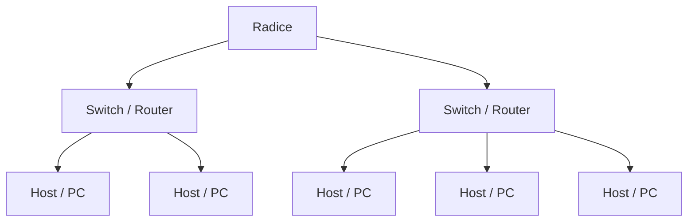
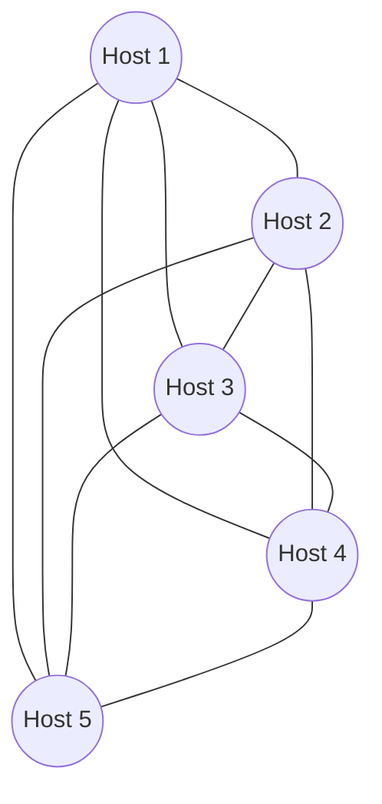
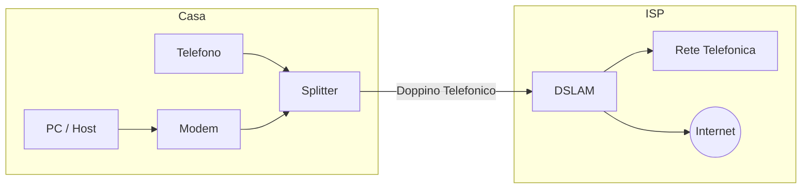
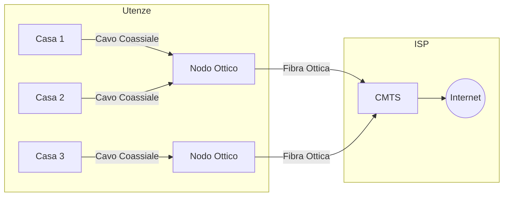
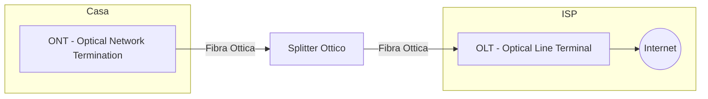
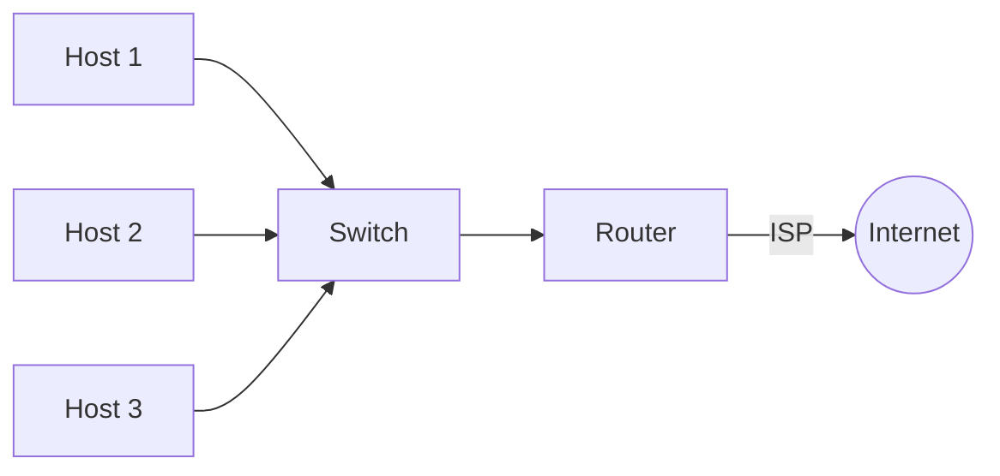
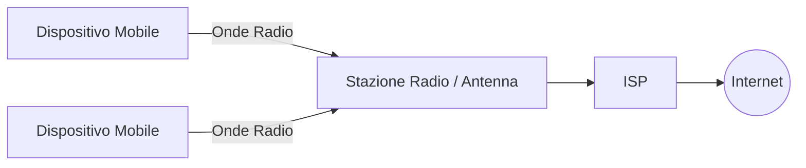
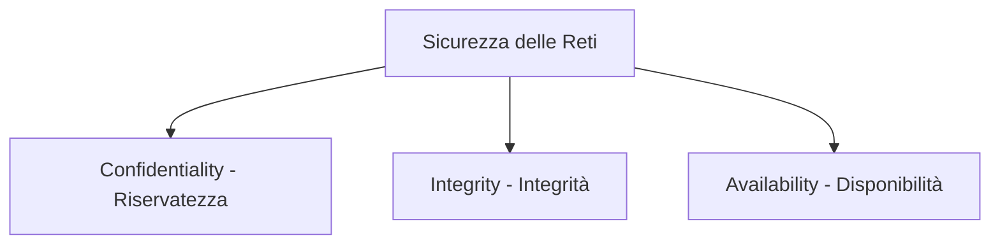

# Topologie di Rete e Tipologie di Connessione ad Internet

## 1. Topologia Fisica e Logica

### Standards IEEE

* **IEEE 802.3**: Ethernet
* **IEEE 754**: Floating Point *(Punto Fluttuante)*
* **IEEE 802.11**: Wi-Fi

---

### Topologie di Rete

#### 1. Topologia ad Albero (Estensione della stella)

* **Nodo Radice**: Gestisce i livelli superiori.
* **Nodi Intermedi**: Switch/Router secondari con vari piani e host.
* **Nodi Foglia**: Host finali (PC).

* **Hub**
* **Switch**
* **Numero di collegamenti**: $n - 1$
* **Vantaggi**: Struttura più complessa ed articolata con più laboratori / uffici.
* **Scalabilità**: Aggiungere degli host è semplice ed immediato.
* **Svantaggio**: Se si rompe la radice è un problema (**Single Point of Failure**).

#### 2. Topologia a Maglia

* **Completamente Connessa**: Ogni nodo è direttamente collegato a tutti gli altri.
  $$\text{Numero di collegamenti} = \frac{n(n - 1)}{2}$$

* **Parzialmente Connessa**: I nodi possono non essere tutti collegati direttamente tra loro.
  $$\text{Numero di collegamenti compreso tra } n - 1 \text{ e } \frac{n(n - 1)}{2}$$

* **Svantaggi**: Struttura complessa / troppi cavi $\rightarrow$ gestione ed installazione difficoltose.

---

## 2. Tipologie di Connessione ad Internet

### A. Accesso Residenziale

#### 1. Connessione DSL (Digital Subscriber Line)

* Utilizza il **doppino telefonico** tradizionale.
* **Splitter**: Separa il segnale analogico vocale dalla banda dati.

##### Il MODEM
* **Modulatore**: Conversione dati digitali $\rightarrow$ dati elettrici (analogici)
* **Demodulatore**: Conversione dati elettrici $\rightarrow$ dati digitali

##### Bande di Frequenza (ADSL - Asymmetric DSL)

1. **Canale Telefonico**: $[0\text{ Hz}, 4\text{ kHz}]$
2. **Canale Upstream**: $[4\text{ kHz}, 50\text{ kHz}]$
3. **Canale Downstream**: $[50\text{ kHz}, 1\text{ MHz}]$

---

#### 2. Cavo (Cable)

* Utilizza **cavo coassiale** e linee in **fibra ottica** (rete ibrida HFC).
* **CMTS** (*Cable Modem Termination System*): Apparato dell'ISP.

* **3 Canali di comunicazione**:
  * Downstream
  * Upstream
  * Segnale TV

---

#### 3. Fibra Ottica — FTTH (Fiber To The Home)

* La fibra ottica arriva direttamente all'interno dell'abitazione dell'utente.
* **ONT** (*Optical Network Termination*): Dispositivo terminale lato utente.
* **OLT** (*Optical Line Terminal*): Apparato di terminazione lato ISP.

---

### B. Accesso Aziendale

#### 1. Ethernet

Rete locale cablata ad alta velocità collegata direttamente al router dell'ISP.

#### 2. Wi-Fi

* Standard **IEEE 802.11**
* **Access Point**: Punto di accesso per la trasmissione radio.
* Configurazione classica: **DSL + Wi-Fi**.

---

### C. Accesso su Larga Scala — WAN Wireless (2G, 3G, 4G, 5G)

Connessione cellulare ad ampio raggio tramite onde radio e stazioni base (antenne).

---

## 3. Affidabilità delle Reti

1. **Fault Tolerance (Tolleranza ai guasti)**
   * Sistemi di backup
   * Ridondanza dei nodi e dei collegamenti

2. **Scalabilità**
   * Capacità della rete di espandersi aggiungendo nuovi host senza perdere in prestazioni.

3. **Quality of Service (QoS)**
   * Gestione del traffico e bilanciamento della banda per mantenere le prestazioni.
   * *Esempio*:
     * Videoconferenza: $2\text{ Mbit/s}$ | Download: $90\text{ Mbit/s}$
     * In caso di cambio del traffico $\rightarrow$ adeguamento dinamico (es. $10\text{ Mbit/s}$ e $90\text{ Mbit/s}$).

4. **Sicurezza**
   * Protezione di: **Dati**, **Dispositivi** (*Devices*), **Utenti**, **Infrastruttura**.

### Il Triplo Principio CIA (Security Triad)

* **Confidentiality** (Riservatezza): I dati sono accessibili solo al personale autorizzato.
* **Integrity** (Integrità): I dati non devono subire alterazioni durante il trasferimento.
* **Availability** (Disponibilità): Le risorse di rete devono rimanere sempre accessibili.
