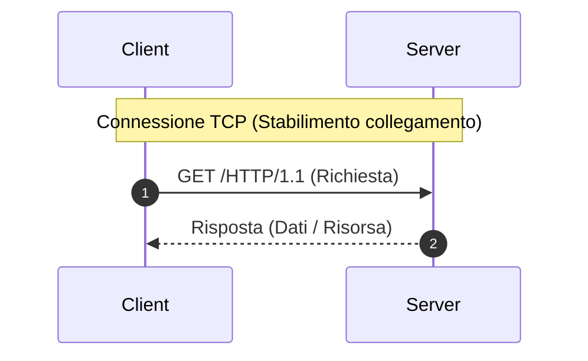
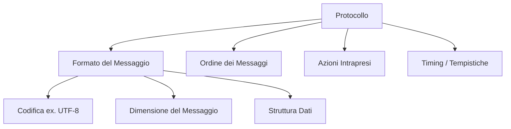
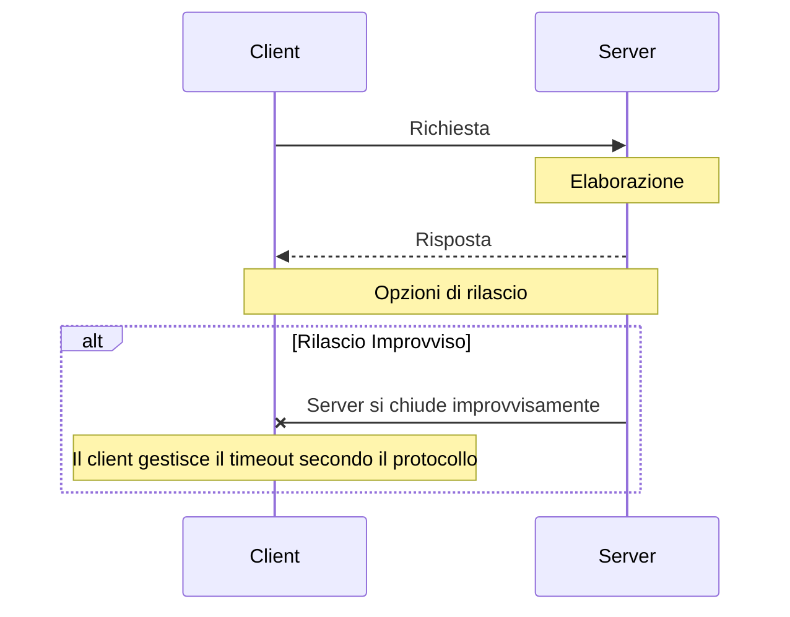
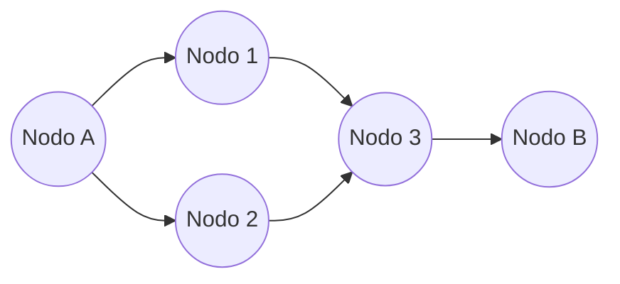
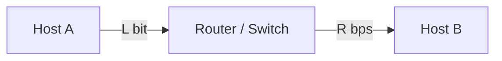
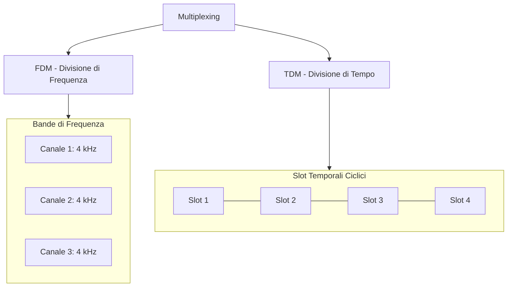
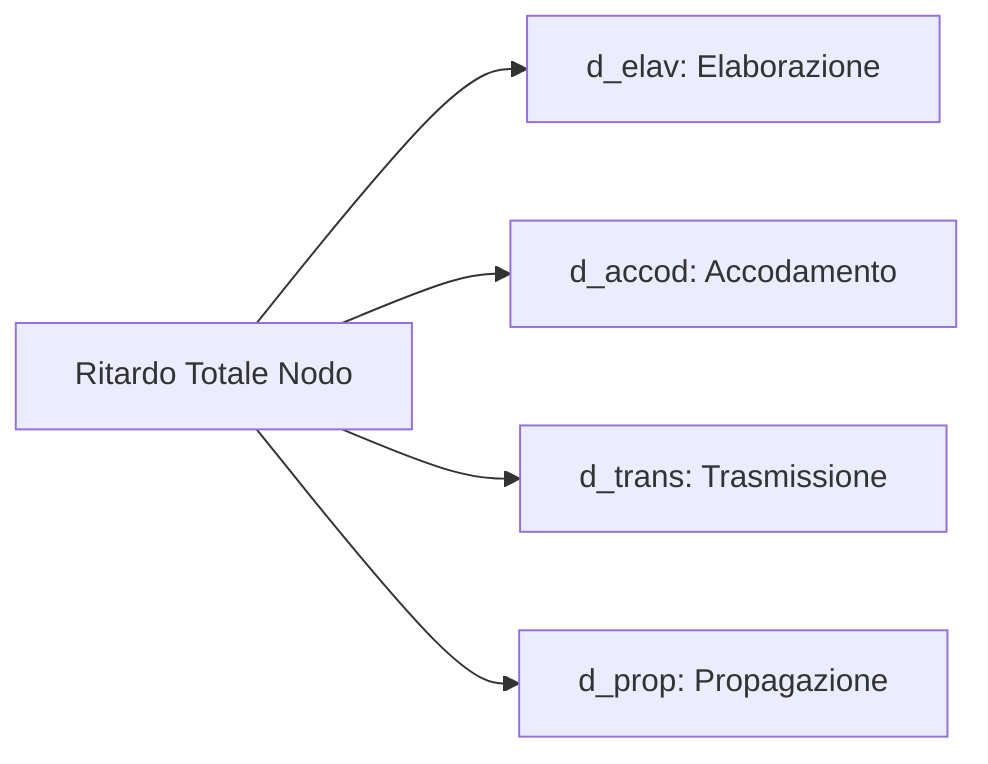

# Sicurezza, Protocolli di Rete e Commutazione

---

## 1. Attacchi alla Sicurezza

### A. Attacchi Interni
Minacce provenienti dall'interno della rete o eseguite locale da software malevolo:
* **Malware**: Categoria generale di software dannoso.
  * **Virus**: Codice malevolo che richiede un file ospite da eseguire.
  * **Worm**: Si replica autonomamente in rete senza bisogno di intervento umano o file ospite.
  * **Spyware**: Software spia progettato per raccogliere informazioni riservate.
  * **Trojan**: Software apparentemente utile che nasconde al suo interno codice malevolo.

### B. Attacchi Esterni
* **DoS (Denial of Service)**: Attacco volto a rendere indisponibile un servizio inondandolo di richieste.
* **DDoS (Distributed Denial of Service)**: Attacco DoS distribuito proveniente da molteplici sorgenti (botnet).
* **Attacchi di Intercettazione**: Un attaccante si inserisce tra due sistemi per ascoltare o alterare la comunicazione.
  * **Intercettazione del traffico** (*Eavesdropping*)
  * **Comunicazione end-to-end violata**
  * **Packet Sniffing**: Cattura e analisi dei pacchetti in transito.
  * **IP Spoofing**: Falsificazione dell'indirizzo IP sorgente per impersonare un nodo fidato.

---

## 2. Concetto di Protocollo

Un **protocollo** è un **insieme di regole** che definisce come due o più dispositivi possono comunicare tra loro.

### Principali Protocolli e Enti di Standardizzazione

* **Protocolli Comuni**:
  * `HTTP` / `HTTPS`: Livello Applicazione (Web)
  * `DNS`: Risoluzione Nomi / Indirizzi IP
  * `IP`: Livello di Rete (Indirizzamento)
  * `TCP` / `UDP`: Livello di Trasporto
  * `Ethernet` (`IEEE 802.3`): Livello Fisico / Data Link cablato
  * `Wi-Fi` (`IEEE 802.11`): Livello Fisico / Data Link wireless

* **Enti e Standard**:
  * **ISO**: *International Organization for Standardization*
  * **IETF**: *Internet Engineering Task Force*
  * **RFC**: *Request for Comments* (Documenti ufficiali degli standard Internet)

---

## 3. Elementi di un Protocollo di Rete

### Struttura del Pacchetto (Formattazione Dati)

Un pacchetto dati è composto da tre parti fondamentali:

| Header (Intestazione) | Dati (Payload) | Trailer (Coda) |
| :--- | :--- | :--- |
| Informazioni di controllo, indirizzo sorgente e destinazione | Dati effettivi da trasmettere | Informazioni gerarchiche e controllo errori (es. CRC) |

### Timing e Gestione Connessione

---

## 4. Tecniche di Commutazione

La **commutazione** è il processo mediante il quale i dati vengono instradati attraverso nodi intermedi dall'origine alla destinazione.

---

### A. Commutazione di Pacchetto (Packet Switching)

Utilizzata in **Internet**. I dati vengono divisi in piccoli blocchi detti **pacchetti**.

* **Tempo di trasmissione di un pacchetto ($d_{\text{trans}}$)**:
  $$d_{\text{trans}} = \frac{L}{R}$$
  * $L$: Dimensione del pacchetto (in bit)
  * $R$: Velocità del collegamento / Banda (in bit/s o bps)

#### Principi chiave:
1. **Store-and-Forward**: Il nodo intermedio deve ricevere l'intero pacchetto ($L$ bit) prima di poterlo ritrasmettere sul collegamento successivo.
   $$\text{Tempo di trasmissione end-to-end} = N \cdot \frac{L}{R}$$
   *(dove $N$ è il numero di collegamenti attravversati)*.
2. **Code di Output (Buffer)**: I router dispongono di memoria limitata per gestire i pacchetti in arrivo.
3. **Perdita di Pacchetti (Packet Loss)**: Se la coda (buffer) si riempie a causa della congestione, i pacchetti in arrivo vengono scartati ed eliminati.

---

### B. Commutazione di Circuito (Circuit Switching)

Tipica delle **reti telefoniche tradizionali**. Viene riservato un canale dedicato e fisso per tutta la durata della comunicazione.

* **Tipi di connessione**:
  * **Locali**: Stessa rete telefonica e vicini.
  * **Di transito**: Aree più estese.
  * **Internazionali**.

#### Tecnica di Multiplexing per la Condivisione delle Risorse

Per condividere un unico mezzo trasmissivo tra più utenti si usano due tecniche principali:

1. **FDM (Frequency Division Multiplexing)**: La banda di frequenza totale viene suddivisa in sotto-canali di frequenza più piccoli.
2. **TDM (Time Division Multiplexing)**: Il tempo viene suddiviso in frame e slot temporali assegnati a turno a ciascun utente.

#### Confronto: Commutazione di Pacchetto vs Circuito

Esempio con un canale da $1\text{ Gbit/s}$ e utenti che richiedono $250\text{ Mbit/s}$:

* **Commutazione di Circuito**: Riserva risorse fisse. Può ospitare al massimo $4$ utenti contemporanei ($4 \times 250\text{ Mbit/s} = 1\text{ Gbit/s}$). Se un utente non trasmette, la sua risorsa è sprecata.
* **Commutazione di Pacchetto**: Permette a più utenti di condividere la banda in modo dinamico (statistico). È più efficiente e fluida quando l'attività degli utenti è intermittente.

---

## 5. Ritardi nelle Reti a Commutazione di Pacchetto

Il ritardo totale subito da un pacchetto in un nodo di rete ($d_{\text{nodo}}$) è composto da **4 componenti principali**:

### Formula del Ritardo di Nodo
$$d_{\text{nodo}} = d_{\text{elav}} + d_{\text{accod}} + d_{\text{trans}} + d_{\text{prop}}$$

1. **Ritardo di Elaborazione ($d_{\text{elav}}$)**:
   * Tempo impiegato dal router per esaminare l'header del pacchetto e determinare la porta di uscita ($\approx \mu s$).
2. **Ritardo di Accodamento ($d_{\text{accod}}$)**:
   * Tempo trascorso dal pacchetto in coda nel buffer in attesa di essere trasmesso (gestione tipicamente **FCFS** - *First Come First Served*). Varia da $ms$ a $\mu s$ in base alla congestione.
3. **Ritardo di Trasmissione ($d_{\text{trans}}$)**:
   * Tempo necessario per spingere tutti i bit del pacchetto sul canale:
     $$d_{\text{trans}} = \frac{L}{R} \quad [\text{secondi}]$$
     *(dove $L$ = bit del pacchetto, $R$ = velocità del link in bps)*.
4. **Ritardo di Propagazione ($d_{\text{prop}}$)**:
   * Tempo impiegato dal singolo bit per viaggiare sul mezzo fisico dal mittente al destinatario:
     $$d_{\text{prop}} = \frac{d}{v} \quad [\text{secondi}]$$
     *(dove $d$ = distanza fisica in metri, $v$ = velocità di propagazione nel mezzo $\approx 2 \times 10^8\text{ m/s}$)*.

### Ritardo End-to-End Totale
Considerando $N$ nodi con traffico bilanciato e senza congestione ($d_{\text{accod}} \approx 0$):

$$d_{\text{end-to-end}} = N \cdot (d_{\text{elav}} + d_{\text{accod}} + d_{\text{trans}} + d_{\text{prop}})$$

