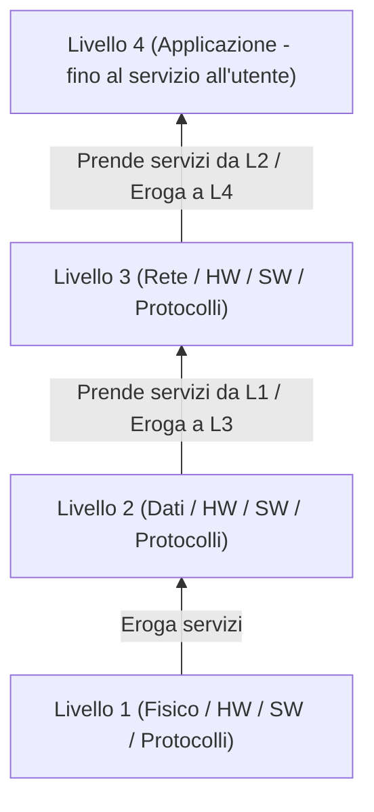

# Architettura a Livelli di Internet (Layering)

## 1. Il Modello a Stratificazione (Layering)

Internet è basato su un'**architettura a livelli (layer)**. Ciascun livello non è solo un'astrazione teorica, ma un modulo funzionale completo.

### Funzionamento di Ogni Livello

Ogni singolo livello all'interno dello stack:
* **Gestisce le proprie risorse**: include componenti **Hardware (HW)**, **Software (SW)** e **Protocolli** specifici per il livello.
* **Esegue Azioni**: elabora i dati ricevuti ed esegue compiti caratteristici del proprio ruolo.
* **Prende Servizi**: sfrutta le funzionalità e i servizi messi a disposizione dal livello immediatamente **inferiore**.
* **Eroga Servizi**: fornisce servizi pronti all'uso al livello immediatamente **superiore** (fino ad arrivare all'utente finale al livello più alto).

---

## 2. Vantaggi e Svantaggi del Layering

### Vantaggi:

1. **Astrazione**: Consente di semplificare la progettazione di sistemi complessi dividendo i compiti in blocchi ben definiti.
2. **Modularità**: Dividere il sistema in livelli/moduli rende più facile la modifica, la manutenzione e l'aggiornamento (la modifica interna ad un livello non impatta direttamente sugli altri, a patto che l'interfaccia rimanga la stessa).
3. **Standardizzazione**: Facilita l'interoperabilità tra apparati e sistemi prodotti da fornitori diversi.

### Svantaggi:

1. **Comunicazione e Separazione Non Perfetta**: I livelli devono comunque comunicare tra loro e non sono totalmente separati; talvolta informazioni di un livello servono a un altro per motivi di efficienza.
2. **Ridondanza ed Inefficienza**: Alcune funzionalità o controlli si ripetono in più livelli (es. controllo dell'errore sia al Livello 2 che al Livello 4), generando overhead e possibile inefficienza.

---

